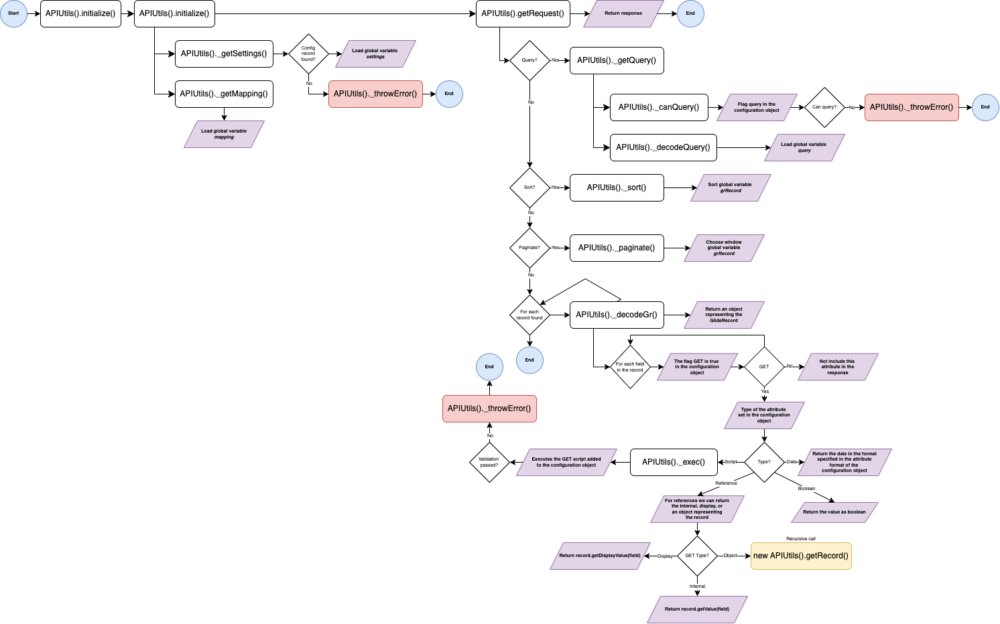

# REST API Engine

[![Contributors][contributors-shield]][contributors-url]
[![Forks][forks-shield]][forks-url]
[![Stargazers][stars-shield]][stars-url]
[![Issues][issues-shield]][issues-url]
[![license-shield]][license-url]

Custom REST API Engine with extended capabilities

**TL;TR; Ask Alex for support**

# Main features

- GET / POST / PUT endpoints
- Query as *ServiceNow Encoded Queries*. (Limited to `AND` queries). Example: `active=true^state=created`
- Paginate the results
- Sort the results
- For related records, you can chooce between obtaining the internal value, display value, or the full record (needs a configuration object)
- Choose what attributes are returned in the responses
- Choose what attributes can be queried
- Post multiple records in one request
- Choose what attributes can be included in POST request
- Mark attributes as mandatory in POST requests
- Choose what attributes can be included in PUT request
- Choose the data type for each attribute
- Order the attributes in the response
- Provide a different name for the attributes in the API (encapsulate data model)
- Can execute scripts for attributes
- Can execute a custom script in POST requests before insert
- Can execute a custom script in PUT requests before update
- Can execute a custom validation script in POST / PUT requests before insert / update
- For choice attributes, check if the value is valid (existing and taking into account the dependent values)
- For date attributes, select the format


# Installation

- Option 1. Committing [update set](./releases/REST_API_Engine_020.xml)

## Technical solution

### Script includes

- `APIUtils()`: Contains the logic of the application.
- `GlideRecordUtils()`: Includes multiple helpers to work with GlideRecord objects


#### Flow GET request



#### Flow POST request


#### Flow PUT request


### Tables

| Table | Description |
| ----- | ----------- |
| REST API Configuration Table | Contains the configuration for a table |
| REST API Configuration Object | Contains the configuration for an object |

### REST API Configuration Table - Attributes

| Attribute                 | Type                          | Default value  | Example                       | Description                                                                                                                                                                                       |
| ------------------------- | ----------------------------- | -------------- | ----------------------------- | ------------------------------------------------------------------------------------------------------------------------------------------------------------------------------------------------- |
| Number                    | String                        |                | CONFTBL0001001                | Human-readable record identifier                                                                                                                                                                  |
| Table                     | Reference to *sys_db_object*  |                | Opportunity[*u_opportunity*]  | Main table in hand. REST requests linked to this configuration object performs mainly over this table. However is it possible to perform actions over different tables via scripts 				 |
| Key                       | Reference to *sys_dictionary* |                | Number[*u_number*]            | Human-readable **unique** attribute representing a record in the table in hand. (i.e.: *sys_user.user_name*, *task.number*)                                                                       |
| Source                    | List of *sys_user*            |                | Abel Tuter, David Loo         | The current configuration object **only applies** for the selected users                                                                                                                          |
| Active                    | Boolean                       | true           |                               | Enable/disable the current record                                                                                                                                                                 |
| Custom POST               | Boolean                       | false          |                               | If enabled, the API Engine executes a custom script for the inserction of new records. If disabled, the API Engine executes `record.insert()` and do not run the custom script                    |
| Custom POST script        | Script                        |                |                               | Custom script executed if the above flag is enabled                                                                          																	 |
| Custom PUT                | Boolean                       | false          |                               | If enabled, the API Engine executes a custom script to update the existing record. If disabled, the API Engine executes `record.update()` and do not run the custom script                        |
| Custom PUT script         | Script                        |                |                               | Custom script executed if the above flag is enabled                                                                         																		 |
| Custom validation         | Boolean                       | false          |                               | If enabled, the API Engine executes a validation script before insert / update any record                                                                                                         |
| Custom validation script  | Script                        |                |                               | Custom script executed if the above flag is enabled                                                                                                                      						 |

### REST API Configuration Object - Attributes

| Attribute                 | Type                                          | Default value     | Example                           | Description                                                                                                                                                                                       |
| ------------------------- | --------------------------------------------- | ----------------- | --------------------------------- | ------------------------------------------------------------------------------------------------------------------------------------------------------------------------------------------------- |
| Number                    | String                                        |                   | OBJCONF0001001                    | Humar-readable record indentifier                                                                                                                                                                 |
| Configuration table       | Reference to *u_rest_api_configuration_table* |                   | CONFTBL0001001                    | Reference to the configuration table                                                                                                                                                              |
| Field                     | Reference to *sys_dictionary*                 |                   | Number *u_opportunity.u_number*   | The database field associated to this configuration object. It is **mandatory** except when type is `script`                                                                                      |
| Active                    | Boolean                                       | true              |                                   | Enable/disable the current record                                                                                                                                                                 |
| Order                     | Integer                                       |                   | 1                                 | The response sorts the attributes included by this field. `sys_id` ** must always be **-1** and the `number` must always be **0**. (Not mandatory but recommended as a good practise)             |
| API field name            | String                                        |                   | shortDescription                  | Represents the attribute in the request (payload and response). Must be written in **camelCase**                                                                                                  |
| GET                       | Boolean                                       | true              |                                   | If enabled, the attribute is returned in the response                                                                                                                                             |
| Get Type                  | Choice                                        |                   | Display                           | Display: returns `record.getDisplayValue(field)`. Internal: returns `record.getValue()`. Object: returns an object representing the record -- **Needs configuration table and objects for it      |
| POST                      | Boolean                                       | false             |                                   | If enabled, the engine accepts this attribute in the payload for *POST* requests                                                                                                                  |
| Required                  | Boolean                                       | false             |                                   | If enabled, the engine marks this attribute as mandatory in the payload for *POST* requests                                                                                                       |
| PUT                       | Boolean                                       | false             |                                   | If enabled, the engine accepts this attribute in the payload for *PUT* requests                                                                                                                   |
| Query                     | Boolean                                       | false             |                                   | If enabled, the engine accepts this attribute for queries in the *GET* requests                                                                                                                   |
| Field type                | Choice                                        | string            | Script                            | Defined the data type contained by this attribute. Possible values: `String`, `Boolean`, `Choice`, `Date`, `Reference`, `Script`.                                                                 |
| Choice set                | Reference to *sys_choice_set*                 |                   | Task state                        | If type is `choice`. You must specify the choice set. It is used to check if the values passed in POST/PUT requests is valid.                                                                     |
| Format                    | String                                        |                   | dd.MM.yyyy                        | If type is `date`. You must specify the format of the date                                                                                                                                        |
| Referenced table name     | Reference to *sys_db_object*                  |                   | Contract                          | If type is `reference`. You must specify the table containing such referenced record                                                                                                              |
| Referenced table id       | Reference to *sys_dictionary*                 |                   | Number                            | If type is `reference`. You must specify the key field identifiying the record in the referenced table                                                                                            |
| Script GET                | Script                                        |                   |                                   | If type is `script`. This script is executed for *GET* requests.                                                                                                             						|
| Script POST               | Script                                        |                   |                                   | If type is `script`. This script is executed for *POST* requests.                                                                                                       							|
| Script PUT                | Script                                        |                   |                                   | If type is `script`. This script is executed for *PUT* requests.                                                                                                              					|

#### Custom POST / PUT script in Configuration Table

```js
(function(scope, record, payload) {
	try {
		// Your code here
		return undefined;
	} catch (e) {
		scope.error = e;
	}
})(scope, record, value);
```

- `scope`: It is used in the `catch` statement to return back to the API Engine potential errors. All code must be included in the `try` statement.
- `record`: Contains a GlideRecord object **NOT** inserted yet. The idea is to perform whatever action is needed before insert the record. Keep in mind that Business rules are not prevented by the engine. You can do it here.
- `payload`: Contains a copy of the original payload received in the request. Just in case is necessary for any action.

#### Custom validation script in Configuration table

```js
(function(scope, record) {
	try {
		// Your code here
		return undefined;
	} catch (e) {
		scope.error = e;
	}
})(scope, record);
```

- `scope`: It is used in the `catch` statement to return back to the API Engine potential errors. All code must be included in the `try` statement.
- `record`: Contains a GlideRecord object **NOT** inserted yet. Keep in mind that Business rules are not prevented by the engine. You can do it here.

#### GET script in Configuration object

```js
(function(scope, record) {
	try {
		// Your code here
		return undefined;
	} catch (e) {
		scope.error = e;
	}
})(scope, record);
```

- `scope`: It is used in the `catch` statement to return back to the API Engine potential errors. All code must be included in the `try` statement.
- `record`: Contains the GlideRecord in hand.

#### POST / PUT script in Configuration object

```js
(function(scope, record, value) {
	try {
		// Your code here
		return undefined;
	} catch (e) {
		scope.error = e;
	}
})(scope, record, value);
```

- `scope`: It is used in the `catch` statement to return back to the API Engine potential errors. All code must be included in the `try` statement.
- `record`: Contains the GlideRecord in hand. **NOT inserted yet for POST requests**.
- `value`: The value contained in the payload for this attribute.

### Client scripts

- `Type changes`: Modify the behavior of the form view of the *REST API Configuration Object*.


### UI Policies

- `Custom POST`: Modify the behavior of the form view of the *REST API Configuration Table*.
- `Custom PUT`: Modify the behavior of the form view of the *REST API Configuration Table*.
- `Custom Validation`: Modify the behavior of the form view of the *REST API Configuration Table*.
- `GET disabled`: Modify the behavior of the form view of the *REST API Configuration Object*.


[contributors-shield]: https://img.shields.io/github/contributors/AlexAlvarez092/SN-REST-API-Engine.svg?style=for-the-badge
[contributors-url]: https://github.com/AlexAlvarez092/SN-REST-API-Engine/graphs/contributors

[forks-shield]: https://img.shields.io/github/forks/AlexAlvarez092/SN-REST-API-Engine.svg?style=for-the-badge
[forks-url]: https://github.com/AlexAlvarez092/SN-REST-API-Engine/network/members

[stars-shield]: https://img.shields.io/github/stars/AlexAlvarez092/SN-REST-API-Engine.svg?style=for-the-badge
[stars-url]: https://github.com/gAlexAlvarez092/SN-REST-API-Engine/stargazers

[issues-shield]: https://img.shields.io/github/issues/AlexAlvarez092/SN-REST-API-Engine.svg?style=for-the-badge
[issues-url]: https://github.com/AlexAlvarez092/SN-REST-API-Engine/issues

[license-shield]: https://img.shields.io/github/license/AlexAlvarez092/SN-REST-API-Engine.svg?style=for-the-badge
[license-url]: https://github.com/AlexAlvarez092/SN-REST-API-Engine/blob/master/LICENSE.txt